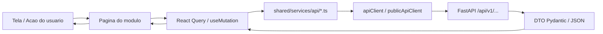
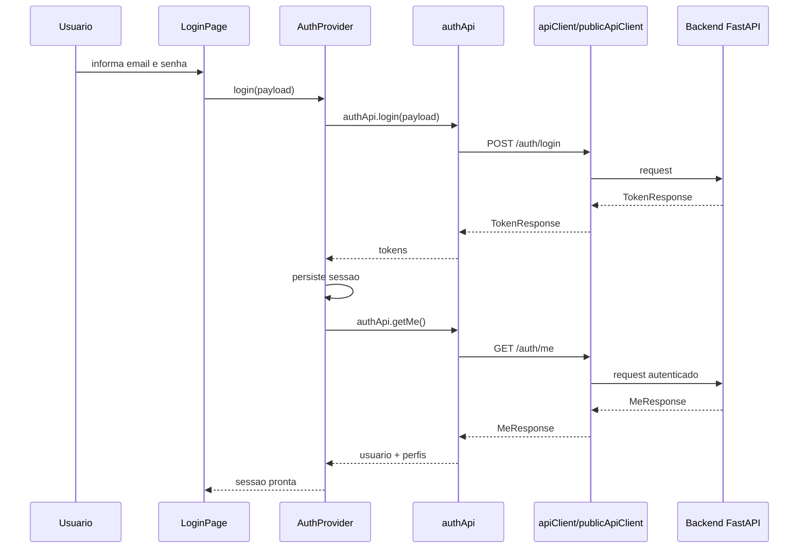
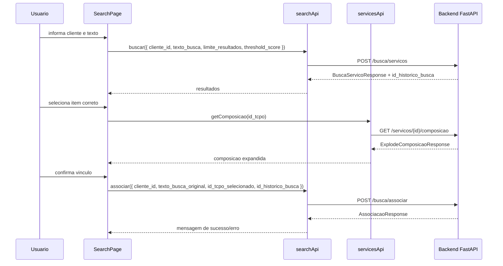

# Dinamica Budget - Frontend Oficial

## 1. Visao geral

Este documento descreve o frontend oficial implementado para o Dinamica Budget, sua arquitetura, os modulos entregues, os contratos de backend consumidos e o fluxo de vinculo entre funcoes do frontend e endpoints do backend FastAPI.

O frontend foi criado como uma SPA corporativa para intranet, com foco em:

- aderencia ao backend existente
- baixo acoplamento entre interface e regras de negocio
- experiencia operacional simples
- sessao autenticada com RBAC refletido pela UI
- organizacao sustentavel para crescimento de novos modulos

O frontend esta localizado em:

`frontend/`

O arquivo principal de documentacao complementar do backend continua sendo:

`README.md`

## 2. Stack adotada

### Base

- React
- TypeScript
- Vite
- React Router
- React Query
- React Hook Form
- Zod
- Axios
- Material UI

### Objetivo da stack

- produtividade de implementacao
- tipagem forte dos contratos
- separacao clara entre tela, estado e consumo HTTP
- interface corporativa limpa e consistente
- manutencao simples para ambiente interno

## 3. Estrutura do frontend

```text
frontend/
  src/
    app/
      App.tsx
      providers.tsx
      router.tsx
      theme.ts
    features/
      admin/
      associations/
      auth/
      clients/
      compositions/
      dashboard/
      homologation/
      permissions/
      profile/
      reports/
      search/
      services/
      users/
    shared/
      components/
        feedback/
        layout/
        navigation/
      services/
        api/
      types/
        contracts/
      utils/
    styles/
      global.css
```

## 4. Arquitetura implementada

### 4.1 Camadas

#### `app/`

Responsavel por bootstrap da aplicacao:

- providers globais
- tema visual
- roteamento
- lazy loading de rotas

#### `features/`

Cada modulo funcional possui sua propria pagina e, quando necessario, sua logica local:

- autenticacao
- dashboard
- catalogo de servicos
- busca inteligente
- homologacao
- composicoes
- administracao
- usuarios
- clientes
- permissoes
- perfil
- relatorios
- associacoes

#### `shared/services/api/`

Camada centralizada de integracao HTTP:

- nao ha chamadas HTTP espalhadas nos componentes visuais
- cada servico aponta para contratos do backend
- o `apiClient` centraliza token, refresh e tratamento de 401

#### `shared/types/contracts/`

Camada de contratos tipados consumidos pelo frontend:

- `auth.ts`
- `busca.ts`
- `servicos.ts`
- `homologacao.ts`
- `admin.ts`
- `common.ts`

#### `shared/components/`

Componentes reutilizaveis e padroes de interface:

- shell autenticado
- sidebar
- topbar
- guards de rota
- tabela padrao
- dialogo de confirmacao
- estado vazio
- aviso de contrato ausente
- badge de status
- feedback global

#### `shared/utils/`

Funcoes de apoio:

- formatacao
- permissao
- persistencia local de sessao
- exportacao CSV

## 5. Shell da aplicacao

O shell autenticado foi implementado com:

- `AppShell`
- `Sidebar`
- `Topbar`
- `ProtectedRoute`
- `PermissionGuard`

Arquivos principais:

- `frontend/src/shared/components/layout/AppShell.tsx`
- `frontend/src/shared/components/layout/Sidebar.tsx`
- `frontend/src/shared/components/layout/Topbar.tsx`
- `frontend/src/shared/components/navigation/ProtectedRoute.tsx`

### Recursos do shell

- menu lateral por agrupamento
- topbar com contexto da rota
- seletor de cliente
- visualizacao do usuario logado
- logout
- bloqueio visual de areas admin para nao-admin
- lazy loading por rota para reduzir payload inicial

## 6. Sessao e autenticacao

### Fluxo implementado

- login com email e senha
- persistencia local de access token e refresh token
- carregamento do contexto do usuario em `/auth/me`
- refresh automatico em caso de `401`
- logout com limpeza de sessao
- sincronizacao do cliente selecionado

### Arquivos principais

- `frontend/src/features/auth/AuthProvider.tsx`
- `frontend/src/features/auth/LoginPage.tsx`
- `frontend/src/shared/services/api/authApi.ts`
- `frontend/src/shared/services/api/apiClient.ts`
- `frontend/src/shared/utils/storage.ts`

### Chaves persistidas no navegador

- access token
- refresh token
- token type
- expiracao
- cliente selecionado

## 7. Rotas implementadas

### Publica

- `/login`

### Autenticadas

- `/dashboard`
- `/busca`
- `/servicos`
- `/homologacao`
- `/composicoes`
- `/associacoes`
- `/relatorios`
- `/perfil`

### Restritas a administrador

- `/admin`
- `/usuarios`
- `/clientes`
- `/permissoes`

Observacao:

- `Clientes` e `Associacoes` estao visiveis no menu porque ja possuem integracao funcional com o backend atual
- `Permissoes` continua fora do menu principal porque ainda nao existe contrato proprio suficiente para um modulo dedicado; a gestao de RBAC por cliente esta centralizada em `Usuarios`
- `Composicoes` segue visivel e operacional com leitura, clonagem e manutencao de componentes em itens proprios do cliente

## 8. Modulos implementados

### 8.1 Login

Status: ativo e integrado

Entrega:

- formulario de login com email
- loading
- erro de autenticacao
- redirecionamento pos-login

Backend consumido:

- `POST /api/v1/auth/login`
- `GET /api/v1/auth/me`
- `POST /api/v1/auth/refresh`
- `POST /api/v1/auth/logout`

### 8.2 Dashboard

Status: ativo e parcialmente dinamico

Entrega:

- resumo do contexto autenticado
- metricas basicas usando servicos e homologacao
- visao dos gaps de contrato ainda nao implementados no backend

Backend consumido:

- `GET /api/v1/servicos/`
- `GET /api/v1/homologacao/pendentes`

### 8.3 Servicos / Catalogo

Status: ativo e integrado

Entrega:

- listagem paginada
- filtro textual
- filtro por categoria id
- escopo por cliente quando aplicavel
- detalhamento da composicao
- criacao de servico TCPO para admin

Backend consumido:

- `GET /api/v1/servicos/`
- `GET /api/v1/servicos/{servico_id}`
- `GET /api/v1/servicos/{servico_id}/composicao`
- `POST /api/v1/servicos/`

### 8.4 Busca Inteligente

Status: ativo e integrado

Entrega:

- formulario de busca
- lista de resultados
- exibicao de origem do match
- score de confianca
- abertura da composicao do item selecionado
- confirmacao de associacao

Backend consumido:

- `POST /api/v1/busca/servicos`
- `POST /api/v1/busca/associar`
- `GET /api/v1/servicos/{servico_id}/composicao`

### 8.5 Homologacao

Status: ativo e integrado

Entrega:

- listagem de itens pendentes
- aprovacao
- reprovacao com motivo
- cadastro de item proprio

Backend consumido:

- `GET /api/v1/homologacao/pendentes`
- `POST /api/v1/homologacao/aprovar`
- `POST /api/v1/homologacao/itens-proprios`

### 8.6 Composicoes

Status: ativo com escopo atual do backend

Entrega:

- listagem de servicos para selecao
- visualizacao da explosao da composicao
- custo total da composicao
- clonagem de composicao para item proprio do cliente
- inclusao de componentes em composicao propria
- remocao de componentes em composicao propria

Backend consumido:

- `GET /api/v1/servicos/`
- `GET /api/v1/servicos/{servico_id}/composicao`
- `POST /api/v1/composicoes/clonar`
- `POST /api/v1/composicoes/{pai_id}/componentes`
- `DELETE /api/v1/composicoes/{pai_id}/componentes/{componente_id}`

### 8.7 Relatorios

Status: parcial

Entrega:

- relatorio tabular de servicos visiveis
- relatorio tabular de pendencias de homologacao
- exportacao CSV do recorte carregado

Backend consumido:

- `GET /api/v1/servicos/`
- `GET /api/v1/homologacao/pendentes`

### 8.8 Administracao

Status: ativo com escopo atual do backend

Entrega:

- disparo da operacao de embeddings

Backend consumido:

- `POST /api/v1/admin/compute-embeddings`

### 8.9 Perfil

Status: leitura ativa, edicao pendente

Entrega:

- visualizacao do usuario autenticado
- visualizacao dos perfis por cliente
- visao do cliente selecionado

Backend consumido:

- `GET /api/v1/auth/me`

### 8.10 Usuarios

Status: ativo com escopo administrativo atual

Entrega:

- cadastro administrativo protegido de usuario
- listagem paginada
- edicao de dados basicos
- ativacao e inativacao
- gestao de perfis por cliente

Backend consumido:

- `POST /api/v1/auth/usuarios`
- `GET /api/v1/usuarios/`
- `PATCH /api/v1/usuarios/{usuario_id}`
- `GET /api/v1/usuarios/{usuario_id}/perfis-cliente`
- `PUT /api/v1/usuarios/{usuario_id}/perfis-cliente`

Observacao:

- este fluxo depende de autenticacao e privilegio administrativo no frontend
- nao se trata de cadastro aberto para usuario operacional comum

### 8.11 Clientes

Status: ativo com escopo administrativo atual

Entrega:

- listagem paginada
- filtro por status
- cadastro de cliente
- edicao de nome fantasia
- ativacao e inativacao

Backend consumido:

- `GET /api/v1/clientes/`
- `POST /api/v1/clientes/`
- `PATCH /api/v1/clientes/{id}`

Observacao:

- o contrato atual de edicao administrativa permite atualizar `nome_fantasia` e `is_active`
- o CNPJ permanece somente leitura neste fluxo

### 8.12 Permissoes

Status: parcial, centralizado em Usuarios

Motivo:

- o backend ja publica manutencao de perfis por cliente, mas esse fluxo foi centralizado em `Usuarios`
- a tela dedicada de `Permissoes` continua fora do menu principal ate existir um contrato proprio separado

### 8.13 Associacoes

Status: ativo com escopo atual do backend

Entrega:

- listagem paginada por cliente
- detalhe do servico relacionado
- exclusao controlada

Backend consumido:

- `GET /api/v1/busca/associacoes`
- `DELETE /api/v1/busca/associacoes/{associacao_id}`

## 9. Contratos tipados consumidos

Arquivos:

- `frontend/src/shared/types/contracts/auth.ts`
- `frontend/src/shared/types/contracts/busca.ts`
- `frontend/src/shared/types/contracts/servicos.ts`
- `frontend/src/shared/types/contracts/usuarios.ts`
- `frontend/src/shared/types/contracts/clientes.ts`
- `frontend/src/shared/types/contracts/associacoes.ts`
- `frontend/src/shared/types/contracts/composicoes.ts`
- `frontend/src/shared/types/contracts/homologacao.ts`
- `frontend/src/shared/types/contracts/admin.ts`
- `frontend/src/shared/types/contracts/common.ts`

Esses arquivos espelham os DTOs do backend e servem como camada unica de tipagem para:

- payloads de request
- responses
- paginacao
- formatos de erro

## 10. Fluxo de vinculo entre frontend e backend

Esta secao mostra, de forma explicita, como cada funcao relevante do frontend se vincula ao backend.

### 10.1 Fluxo geral



### 10.2 Fluxo de autenticacao



### 10.3 Fluxo principal de busca e vinculo



## 11. Mapa funcao frontend -> endpoint backend

| Modulo | Arquivo frontend | Funcao frontend | Endpoint backend | Metodo | Objetivo |
|---|---|---|---|---|---|
| Auth | `authApi.ts` | `login(payload)` | `/auth/login` | POST | Autenticar usuario |
| Auth | `authApi.ts` | `refresh(refreshToken)` | `/auth/refresh` | POST | Renovar sessao |
| Auth | `authApi.ts` | `getMe()` | `/auth/me` | GET | Carregar usuario e perfis |
| Auth | `authApi.ts` | `logout()` | `/auth/logout` | POST | Encerrar sessao |
| Usuarios | `authApi.ts` | `createUsuario(payload)` | `/auth/usuarios` | POST | Cadastrar usuario |
| Servicos | `servicesApi.ts` | `list(params)` | `/servicos/` | GET | Listar catalogo visivel |
| Servicos | `servicesApi.ts` | `getById(servicoId)` | `/servicos/{id}` | GET | Consultar servico |
| Servicos | `servicesApi.ts` | `getComposicao(servicoId)` | `/servicos/{id}/composicao` | GET | Explodir composicao |
| Servicos | `servicesApi.ts` | `create(payload)` | `/servicos/` | POST | Criar item TCPO global |
| Busca | `searchApi.ts` | `buscar(payload)` | `/busca/servicos` | POST | Buscar servico por cliente/texto |
| Busca | `searchApi.ts` | `associar(payload)` | `/busca/associar` | POST | Confirmar/fortalecer associacao |
| Homologacao | `homologationApi.ts` | `listPendentes(clienteId, page, pageSize)` | `/homologacao/pendentes` | GET | Listar pendencias |
| Homologacao | `homologationApi.ts` | `aprovar(payload)` | `/homologacao/aprovar` | POST | Aprovar ou reprovar item |
| Homologacao | `homologationApi.ts` | `criarItemProprio(payload)` | `/homologacao/itens-proprios` | POST | Criar item proprio pendente |
| Admin | `adminApi.ts` | `computeEmbeddings()` | `/admin/compute-embeddings` | POST | Disparar rotina administrativa |
| Usuarios | `userApi.ts` | `list(params)` | `/usuarios/` | GET | Listar usuarios |
| Usuarios | `userApi.ts` | `update(usuarioId, payload)` | `/usuarios/{id}` | PATCH | Atualizar usuario |
| Usuarios | `userApi.ts` | `getPerfis(usuarioId)` | `/usuarios/{id}/perfis-cliente` | GET | Consultar perfis por cliente |
| Usuarios | `userApi.ts` | `setPerfis(usuarioId, payload)` | `/usuarios/{id}/perfis-cliente` | PUT | Definir perfis por cliente |
| Clientes | `clientsApi.ts` | `list(params)` | `/clientes/` | GET | Listar clientes |
| Clientes | `clientsApi.ts` | `create(payload)` | `/clientes/` | POST | Cadastrar cliente |
| Clientes | `clientsApi.ts` | `patch(clienteId, payload)` | `/clientes/{id}` | PATCH | Editar cliente e alterar status |
| Associacoes | `associationsApi.ts` | `list(params)` | `/busca/associacoes` | GET | Listar associacoes |
| Associacoes | `associationsApi.ts` | `remove(id)` | `/busca/associacoes/{id}` | DELETE | Excluir associacao |
| Composicoes | `composicoesApi.ts` | `clonar(payload)` | `/composicoes/clonar` | POST | Clonar composicao para item proprio |
| Composicoes | `composicoesApi.ts` | `adicionarComponente(paiId, payload)` | `/composicoes/{pai_id}/componentes` | POST | Adicionar componente |
| Composicoes | `composicoesApi.ts` | `removerComponente(paiId, componenteId)` | `/composicoes/{pai_id}/componentes/{componente_id}` | DELETE | Remover componente |

## 12. Mapa pagina -> funcao -> backend

### Login

- `LoginPage`
  - chama `useAuth().login(payload)`
  - `useAuth().login` chama `authApi.login`
  - em seguida chama `authApi.getMe`

### Dashboard

- `DashboardPage`
  - chama `servicesApi.list`
  - opcionalmente chama `homologationApi.listPendentes`

### Servicos

- `ServicesPage`
  - chama `servicesApi.list`
  - ao selecionar item, chama `servicesApi.getComposicao`
  - se admin, pode chamar `servicesApi.create`

### Busca

- `SearchPage`
  - chama `searchApi.buscar`
  - ao selecionar resultado, chama `servicesApi.getComposicao`
  - ao confirmar vinculo, chama `searchApi.associar`

### Homologacao

- `HomologationPage`
  - chama `homologationApi.listPendentes`
  - chama `homologationApi.aprovar`
  - chama `homologationApi.criarItemProprio`

### Composicoes

- `CompositionsPage`
  - chama `servicesApi.list`
  - chama `servicesApi.getComposicao`
  - chama `composicoesApi.clonar`
  - chama `composicoesApi.adicionarComponente`
  - chama `composicoesApi.removerComponente`

### Relatorios

- `ReportsPage`
  - chama `servicesApi.list`
  - chama `homologationApi.listPendentes`
  - exporta CSV somente do recorte retornado

### Administracao

- `AdminPage`
  - chama `adminApi.computeEmbeddings`

### Perfil

- `ProfilePage`
  - usa dados carregados por `authApi.getMe`

### Usuarios

- `UsersPage`
  - chama `userApi.create`
  - `userApi.create` delega para `authApi.createUsuario`
  - chama `userApi.list`
  - chama `userApi.update`
  - chama `userApi.getPerfis`
  - chama `userApi.setPerfis`

### Clientes

- `ClientsPage`
  - chama `clientsApi.list`
  - chama `clientsApi.create`
  - chama `clientsApi.patch`

### Associacoes

- `AssociationsPage`
  - chama `associationsApi.list`
  - chama `associationsApi.remove`

## 13. Fluxo de refresh automatico

O `apiClient` intercepta respostas `401` e tenta renovar a sessao automaticamente:

1. request autenticado falha com `401`
2. `apiClient` verifica se nao eh request de login/refresh
3. chama `POST /auth/refresh`
4. persiste novos tokens
5. repete a request original
6. se refresh falhar, dispara evento de expiracao de sessao
7. `AuthProvider` limpa sessao e redireciona para `/login`

Arquivo central:

- `frontend/src/shared/services/api/apiClient.ts`

## 14. Regras de visibilidade e permissao no frontend

O frontend nao eh autoridade de seguranca. Ele apenas reflete o contexto devolvido pelo backend.

O que foi implementado:

- bloqueio de rotas autenticadas
- bloqueio visual de areas admin
- seletor de cliente com respeito aos vinculos carregados em `/auth/me`
- verificacao de acesso por cliente para exibir ou ocultar acoes
- tratamento de sessao expirada

O que continua sendo responsabilidade real do backend:

- autorizacao final
- RBAC efetivo
- acesso por cliente
- validacao de ownership
- seguranca de operacoes criticas

## 15. Modulos preparados, mas dependentes de contrato

Os seguintes pontos continuam dependentes de contratos adicionais ou evolucoes de backend:

- edicao de clientes
- modulo dedicado de permissoes
- relatorios de outras tabelas
- edicao de perfil
- exclusao de usuarios, se fizer parte do produto

Isso foi intencional para evitar:

- inventar endpoint
- inventar payload
- simular regra inexistente
- introduzir divergencia entre UI e backend

No menu principal:

- `Clientes` e `Associacoes` retornaram ao fluxo principal por ja terem integracao real
- `Permissoes` continua fora do menu porque o fluxo esta centralizado em `Usuarios`
- `Clientes` segue sinalizado como ativo, com listagem, cadastro, edicao e controle de status

## 16. Gaps reais identificados no backend durante a implementacao

### 16.1 Clientes

O frontend ja possui listagem, cadastro, edicao e controle de status de clientes. O backend ja publica:

- `PATCH /api/v1/clientes/{id}` para edicao e ativacao/inativacao

### 16.2 Perfil

O frontend ja possui leitura do usuario autenticado. O que continua faltando no backend e:

- `PUT /api/v1/auth/me` ou `PATCH /api/v1/auth/me` para autoedicao de perfil

### 16.3 Relatorios

Os relatorios atuais reutilizam endpoints operacionais existentes. Continuam pendentes, se o produto exigir:

- endpoints dedicados de relatorio paginado por dominio

## 17. Como executar o frontend

### Desenvolvimento

```bash
cd frontend
npm install
npm run dev
```

### Build de producao

```bash
cd frontend
npm run build
```

### Lint

```bash
cd frontend
npm run lint
```

## 18. Variaveis de ambiente

Arquivo:

- `frontend/.env.example`

Variavel atual:

```env
VITE_API_URL=/api/v1
```

Uso esperado:

- em desenvolvimento, o Vite faz proxy para `http://localhost:8000`
- em producao/intranet, o frontend deve apontar para o backend oficial da aplicacao

## 19. Arquivos principais para leitura rapida

### Bootstrap

- `frontend/src/main.tsx`
- `frontend/src/app/App.tsx`
- `frontend/src/app/providers.tsx`
- `frontend/src/app/router.tsx`
- `frontend/src/app/theme.ts`

### Sessao

- `frontend/src/features/auth/AuthProvider.tsx`
- `frontend/src/shared/services/api/apiClient.ts`
- `frontend/src/shared/services/api/authApi.ts`

### Shell

- `frontend/src/shared/components/layout/AppShell.tsx`
- `frontend/src/shared/components/layout/Sidebar.tsx`
- `frontend/src/shared/components/layout/Topbar.tsx`

### Modulos operacionais

- `frontend/src/features/search/SearchPage.tsx`
- `frontend/src/features/services/ServicesPage.tsx`
- `frontend/src/features/homologation/HomologationPage.tsx`
- `frontend/src/features/compositions/CompositionsPage.tsx`
- `frontend/src/features/reports/ReportsPage.tsx`

### Tipos e contratos

- `frontend/src/shared/types/contracts/*.ts`

## 20. Resumo final

O frontend oficial entregue cobre a base estrutural do sistema e os fluxos reais suportados hoje pelo backend:

- autenticacao
- sessao
- shell autenticado
- dashboard
- servicos
- busca inteligente
- associacao manual
- homologacao
- item proprio
- composicao visual
- relatorios parciais
- administracao
- perfil
- cadastro parcial de usuario

Ao mesmo tempo, o frontend foi construido para nao ultrapassar o contrato do backend:

- modulos sem endpoint real foram mantidos preparados, mas retirados do menu principal ou rebaixados visualmente
- avisos de contrato ausente foram adicionados nas telas correspondentes
- a camada de API foi centralizada e tipada
- a UI reflete o RBAC, mas nao tenta substituir a seguranca do servidor

Esse README deve servir como base para:

- onboarding do frontend
- alinhamento frontend/backend
- evolucao de contratos
- rastreio dos modulos ja integrados e dos modulos ainda pendentes
