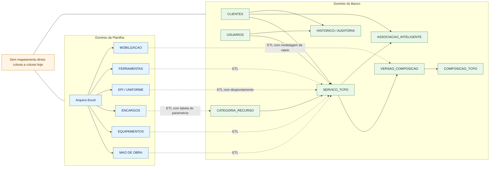
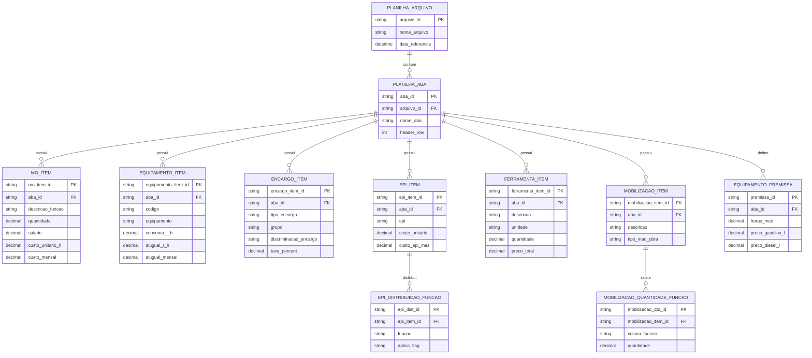

# Mapa visual: Planilha x Banco

Objetivo: visualizar em um formato mais claro e rapido o modelo da planilha e o modelo do banco, no mesmo documento.

Fontes:
- Planilha: tabelas/PC tabelas.xlsx
- Banco: app/models e app/alembic/versions

---

## 1) Visao executiva (lado a lado)



---

## 2) DER da planilha (focado no que existe no Excel)



---

## 3) DER do banco (focado em operacao da aplicacao)

```mermaid
erDiagram
    CLIENTES ||--o{ PERMISSAO_OPERACIONAL : possui
    USUARIOS ||--o{ PERMISSAO_OPERACIONAL : recebe

    CLIENTES ||--o{ SERVICO_TCPO : escopo
    CATEGORIA_RECURSO ||--o{ SERVICO_TCPO : classifica
    USUARIOS ||--o{ SERVICO_TCPO : aprova
    SERVICO_TCPO ||--|| TCPO_EMBEDDINGS : embedding

    SERVICO_TCPO ||--o{ VERSAO_COMPOSICAO : versiona
    VERSAO_COMPOSICAO ||--o{ COMPOSICAO_TCPO : contem
    SERVICO_TCPO ||--o{ COMPOSICAO_TCPO : pai
    SERVICO_TCPO ||--o{ COMPOSICAO_TCPO : filho

    CLIENTES ||--o{ ASSOCIACAO_INTELIGENTE : contexto
    SERVICO_TCPO ||--o{ ASSOCIACAO_INTELIGENTE : referencia

    CLIENTES ||--o{ HISTORICO_BUSCA_CLIENTE : historico
    USUARIOS ||--o{ HISTORICO_BUSCA_CLIENTE : usuario
    CLIENTES ||--o{ AUDITORIA_LOG : auditoria
    USUARIOS ||--o{ AUDITORIA_LOG : usuario

    CLIENTES {
        uuid id PK
        string nome_fantasia
        string cnpj UK
        bool is_active
    }

    USUARIOS {
        uuid id PK
        string email UK
        bool is_active
        bool is_admin
    }

    PERMISSAO_OPERACIONAL {
        uuid usuario_id PK, FK
        uuid cliente_id PK, FK
        string perfil PK
    }

    CATEGORIA_RECURSO {
        int id PK
        string descricao
        string tipo_custo
    }

    SERVICO_TCPO {
        uuid id PK
        uuid cliente_id FK NULL
        string codigo_origem
        text descricao
        string unidade_medida
        decimal custo_unitario
        int categoria_id FK NULL
        string origem
        string status_homologacao
        string tipo_recurso
    }

    VERSAO_COMPOSICAO {
        uuid id PK
        uuid servico_id FK
        int numero_versao
        uuid cliente_id FK NULL
        bool is_ativa
    }

    COMPOSICAO_TCPO {
        uuid id PK
        uuid servico_pai_id FK
        uuid insumo_filho_id FK
        decimal quantidade_consumo
        uuid versao_id FK
    }

    TCPO_EMBEDDINGS {
        uuid id PK, FK
        vector vetor
    }

    ASSOCIACAO_INTELIGENTE {
        uuid id PK
        uuid cliente_id FK
        uuid servico_tcpo_id FK
        int frequencia_uso
        string status_validacao
    }

    HISTORICO_BUSCA_CLIENTE {
        uuid id PK
        uuid cliente_id FK NULL
        uuid usuario_id FK NULL
        text texto_busca
    }

    AUDITORIA_LOG {
        uuid id PK
        string tabela
        string operacao
        uuid usuario_id FK NULL
        uuid cliente_id FK NULL
    }
```

---

## 4) Como ler rapido

- Azul: estrutura da planilha (analitica e matricial).
- Verde: estrutura do banco (transacional e versionada).
- Linhas pontilhadas: caminhos de ETL possiveis.
- Caixa laranja: alerta de que nao existe mapeamento direto 1:1 hoje.

