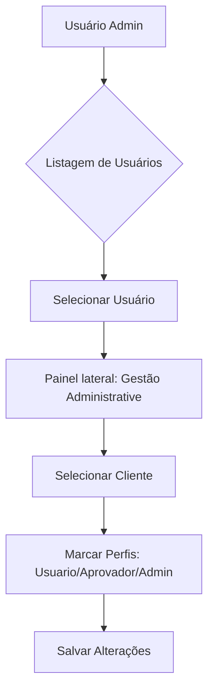
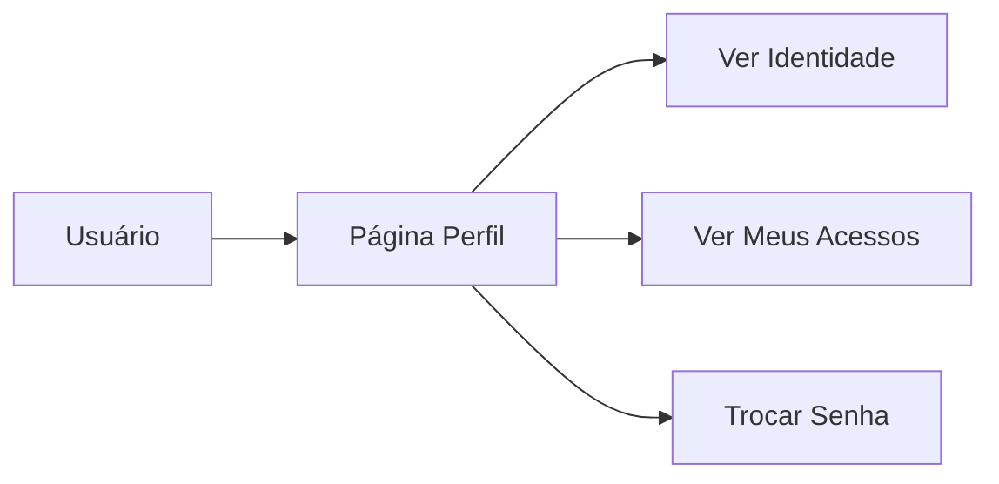

# Wireframes e Critérios — Governança e Permissões

Este documento consolida as decisões de UX e critérios de aceite para o módulo de Governança, entregues na Sprint S-07.

## Telas Entregues

1. **Gestão de Usuários (Admin)**
   - Local: `/usuarios`
   - Funcionalidades: Listagem paginada, filtros por status (Ativo/Inativo), criação de novos usuários e edição de metadados.
   - RBAC Integrado: A gestão de perfis por cliente foi unificada nesta tela para simplificar a administração centralizada.

2. **Meu Perfil**
   - Local: `/perfil`
   - Funcionalidades: Visualização de dados de identidade, troca de senha e listagem de perfis por cliente.
   - Melhoria S-07: Resolução de nomes de clientes em vez de exibir apenas UUIDs.

3. **Dashboard de Governança**
   - Local: `/dashboard`
   - Atualização S-07: Resumo de status da plataforma indicando módulos operacionais e centralização de RBAC.

4. **Clientes**
   - Local: `/clientes`
   - Funcionalidades: CRUD de clientes e ativação/inativação.

## Critérios de Aceite Validados

- [x] **Admin Global:** Visualiza e gerencia todos os usuários e clientes do sistema.
- [x] **Gestão de RBAC:** Possível atribuir múltiplos perfis (USUARIO, APROVADOR, ADMIN) a um usuário para clientes específicos.
- [x] **Meu Perfil:** Usuário pode atualizar seu próprio nome e trocar a senha de acesso.
- [x] **Transparência:** Listagem de acessos no perfil do usuário agora exibe o nome fantasia do cliente.
- [x] **Consistência:** Removidos placeholders de "em breve" ou "TODO" das áreas de governança.
- [x] **Segurança:** Todas as telas de admin respeitam a flag `is_admin` do token JWT.

## Wireframes Conceituais

### Fluxo de Permissões

### Fluxo de Perfil

